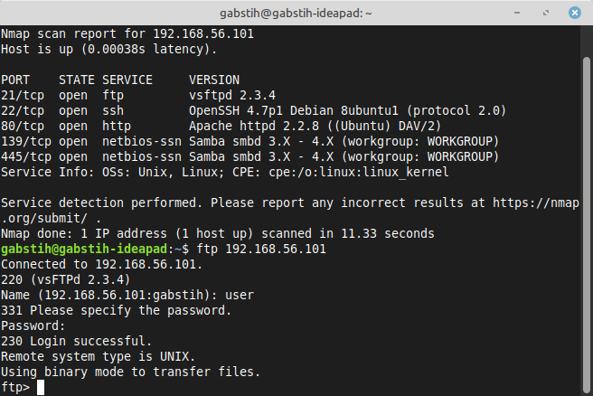

# DIO-BruteforceChallenge
Desafio proposto pela DIO para testar conhecimentos à respeito do Bruteforce e das ferramentas do Kali LInux

## Simulando um Ataque de Brute Force de Senhas com Medusa e Kali Linux nos protocolos de rede FTP (transferência de arquivos), HTTP (web) e SMB (compartilhamento de recursos).
### CONFIGURAÇÕES INICIAIS

1º - Instalar o Kali Linux e o Metasploitable no Virtual Box  
(no meu caso, estarei utilizando o meu linux mint ao invés do kali linux, mas o recomendado é criar uma máquina virtual com o Kali, pois o mesmo já vem com todas as ferramentas que precisa!)

<placeholder>

2º - Inicie os dois e faça um snapshot no metasploitable para caso ocorra uma falha ou um comprometimento da máquina, você pode recuperar a partir daquele ponto. Para isso, vá para a guia "MÁQUINA" do virtualbox com o metasploitable aberto, clique em "Criar Snapshot", adicione um nome e uma descrição para a sua snapshop, e clique em ok.

    

3º - Acessar o metasploitable utilizando o login padrão: msfadmin, e senha: msfadmin

    

4º - Digite o comando "ip a" no metasploitable e anote o ip da máquina que estará na linha inet addr. Este será o ip utilizado para os testes do Kali.

    

5º - Digite o comando "ping -c 3 nú.me.ro.ip" para testar se nossa máquina consegue se comunicar com o ip alvo
Se houve resposta, significa que nossas duas máquinas estão se comunicando sem problemas.

    

 

## Simulando um ataque a um servidor FTP para verificar falhas de segurança em um cenário de auditoria.

1º - Faremos uma enumeração para descobrir quais portas estão disponíveis no ip alvo com suspeita de vulnerabilidade.
 
O comando que utilizaremos será o seguinte: nmap -sV -p 21,22,80,445,139 192.168.xx.x
Se a porta ftp estiver aberta tentaremos conectá-la diretamente.

    

2º - Ao confirmar as portas, agora tentaremos conectar diretamente ao FTP, com a finalidade de verificar se o mesmo recebe nossa conexão
O comando em questão será: ftp 192.168.XX.XXX

    

Caso a conexão aconteça pedirá o login e a senha. Como ainda não sabemos nenhum dos dois precisaremos fazer um ataque brute force (força bruta) utilizando a ferramenta Medusa para tentar descobri-los. Antes disso temos que criar duas listas: uma com possíveis nomes de usuários e outra com senhas comuns.
