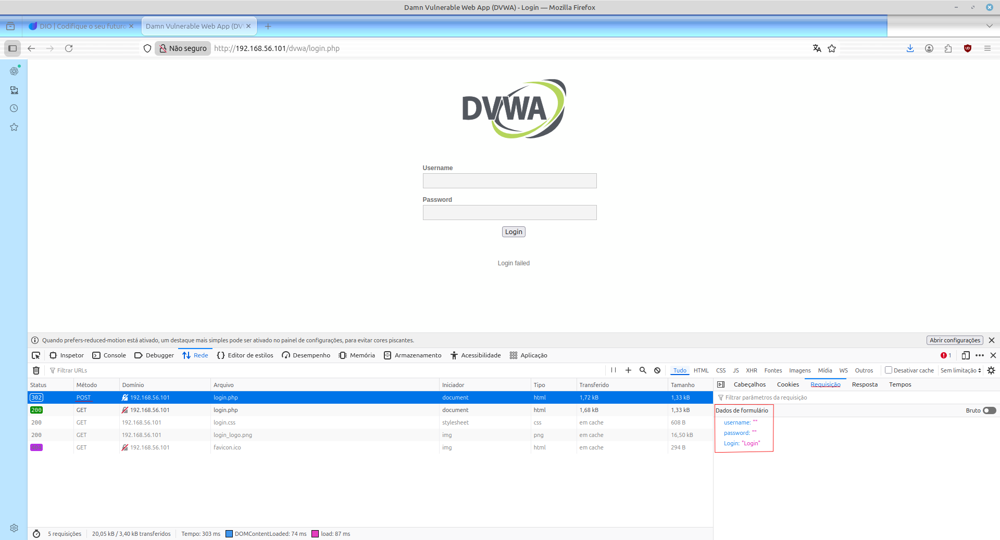
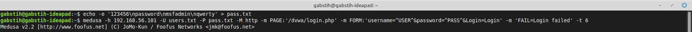
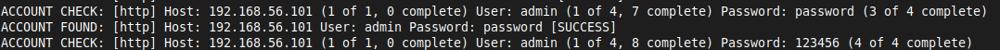
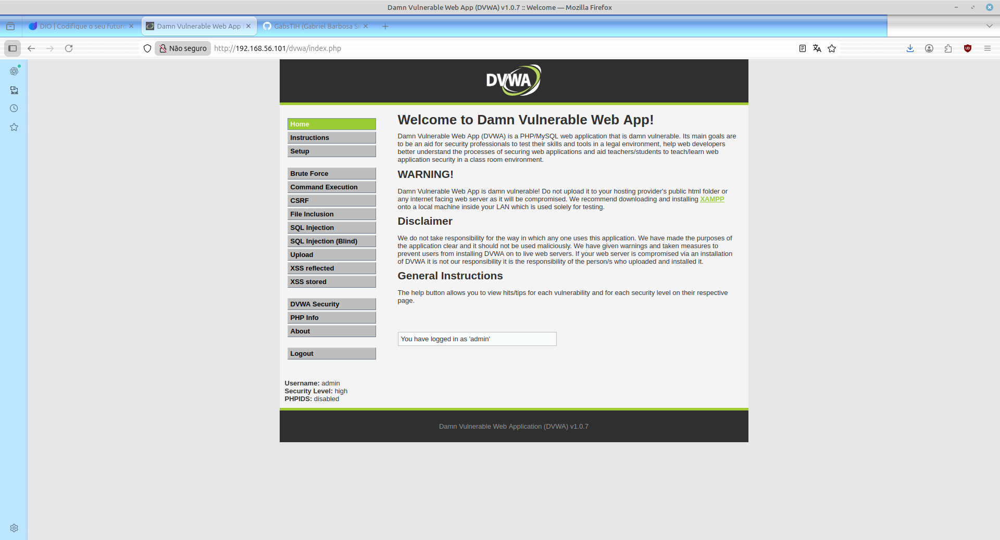
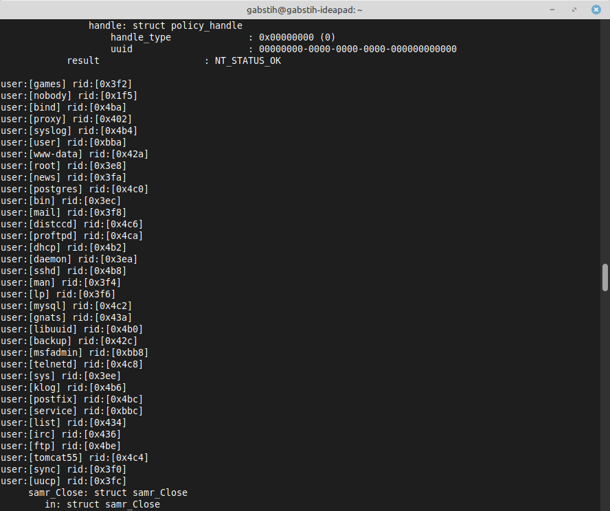
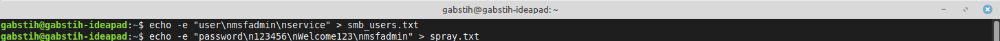
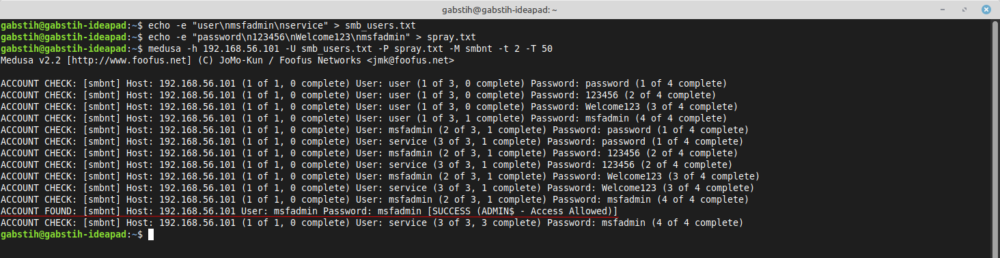
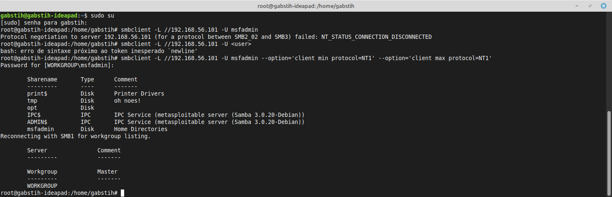

# DIO-BruteforceChallenge
Desafio proposto pela DIO para testar conhecimentos à respeito do Bruteforce e das ferramentas do Kali LInux

## Simulando um Ataque de Brute Force de Senhas com Medusa e Kali Linux nos protocolos de rede FTP (transferência de arquivos), HTTP (web) e SMB (compartilhamento de recursos).
### CONFIGURAÇÕES INICIAIS

1º - Instale o Kali Linux e o Metasploitable no Virtual Box  
(no meu caso, estarei utilizando o meu linux mint ao invés do kali linux, mas o recomendado é criar uma máquina virtual com o Kali, pois o mesmo já vem com todas as ferramentas que precisa!)

2º - Inicie os dois e faça um snapshot no metasploitable para caso ocorra uma falha ou um comprometimento da máquina, você pode recuperar a partir daquele ponto. Para isso, vá para a guia "MÁQUINA" do virtualbox com o metasploitable aberto, clique em "Criar Snapshot", adicione um nome e uma descrição para a sua snapshop, e clique em ok.

    

3º - Acessar o metasploitable utilizando o login padrão: msfadmin, e senha: msfadmin

    

4º - Digite o comando "ip a" no metasploitable e anote o ip da máquina que estará na linha inet addr. Este será o ip utilizado para os testes do Kali.

    

5º - Digite o comando "ping -c 3 192.168.XX.XXX" para testar se nossa máquina consegue se comunicar com o ip alvo
Se houve resposta, significa que nossas duas máquinas estão se comunicando sem problemas.

    

 

## Simulando um ataque a um servidor FTP para verificar falhas de segurança em um cenário de auditoria.

1º - Faremos uma enumeração para descobrir quais portas estão disponíveis no ip alvo com suspeita de vulnerabilidade.
 
O comando que utilizaremos será o seguinte: nmap -sV -p 21,22,80,445,139 192.168.XX.XXX
Se a porta ftp estiver aberta tentaremos conectá-la diretamente.

    

2º - Ao confirmar as portas, agora tentaremos conectar diretamente ao FTP, com a finalidade de verificar se o mesmo recebe nossa conexão
O comando em questão será: ftp 192.168.XX.XXX

    

Ao se conectar, ele vai pedir para que digitemos um login e uma senha. Como ainda não sabemos ambos, precisaremos fazer um ataque de Brute Force utilizando a ferramenta Medusa para tentar descobrir o login e a senha. Antes de tudo, criaremos duas listas: uma com possíveis nomes de usuários e outra com senhas comuns.

### Criando nomes de usuários e senhas comuns (wordlists) em diferentes arquivos e realizando o ataque

1º - Utilizaremos dois comandos para criar e salvar no Kali Linux arquivos de texto com possíveis nomes de usuários e senhas comuns.  
Para usuários utilizaremos: echo -e "user\nmsfadmin\nadmin\nroot" > users.txt  
E para senhas utilizaremos: echo -e "123456\npassword\nqwerty\nmsfadmin" > pass.txt

    

2º - Agora partiremos pro ataque com a ferramenta Medusa  
Utilizaremos o comando: medusa -h 192.168.XX.XXX -U users.txt -P pass.txt -M ftp -t6

    

Como resultado do ataque, foram encontrados o login msfadmin e a senha msfadmin como credenciais válidas. Significando que conseguiremos acessar o sistema via FTP com essas credenciais.

3º - Novamente, entraremos no FTP, confirmando se as credenciais obtidas de fato estão corretas

    

## Simulando um ataque web (HTTP) fazendo Brute Force em formulários de login web no sistema do DVWA

1º - Acessaremos no navegador o endereço 192.168.XX.XXX/dvwa/login.php para visualizar a página de teste de login do DVWA.
 
Na sequência, abriremos o painel de ferramentas do desenvolvedor na página de teste de login do DVWA pressionando F12. Logo em seguida clicaremos na guia network, e realizaremos uma tentativa de login na página, ficando de olho no que a aba Network retornar, muito possivelmente veremos um status de "POST", clicando nele, iremos em "Request" na aba ao lado direito. Com isso, mostrará tudo o que o navegador está enviando e recebendo durante a interação, incluindo os nomes dos parâmetros que o servidor espera receber. A Medusa vai simular em cima destes parâmetros.

    

2º - No terminal, após criadas as wordlists de usuários e de senhas, rodaremos o seguinte comando:   medusa -h nú.me.ro.ip -U users.txt -P pass.txt -M http -m PAGE:'/dvwa/login.php' -m FORM:'username=^USER^&password=^PASS^&Login=Login' -m 'FAIL=Login failed' -t 6  
As credenciais corretas encontradas aparecerão com a palavra SUCCESS.

    

    

Em seguida utilizamos o primeiro login e senha encontrados para acessar o sistema.

    

E assim, entramos na página web.

## Simulando Ataque SMB (Server Message Block) usando ataques de enumeração e spraying contra o serviço SMB.

1º - Faremos uma enumeração de usuários com enum4linux  
O comando será: enum4linux -a 192.168.XX.XXX | tee enum4_output.txt

    

2º - Logo em sequência, podemos ver o arquivo do comando e visualizar usuários que sejam possíveis alvos de ataques. O número RID é o identificador relativo do usuário no sistema. Sempre que houver nomes de usuários genéricos como "null" ou interrogação geralmente são de usuários mais vulneráveis.

3º - Agora, criaremos a wordlist dos usuários, no comando anterior conseguimos acesso aos usernames agora precisaremos criar nosso arquivo de alvos e nosso arquivo de senhas.  
O comando para os usuários será: echo -e "user\nmsfadmin\nservice" > smb_users.txt  
E o comando para as senhas será: echo -e "password\n123456\nWelcome123\nmsfadmin" > spray.txt

    

Ao contrário do brute force, o password spraying testa poucas senhas em muitos usuários.

4º - Agora, é hora do ataque. O comando em questão será: medusa -h 192.168.XX.XXX -U smb_users.txt -P senhas_spray.txt -M smbnt -t 2 -T 50

    

5º - E agora, testaremos o acesso ao SMB usando o smbclient  
O comando será: smbclient -L //192.168.XX.XXX -U msfadmin
Coloquei alguns parâmetros a mais pois no meu Linux Mint, o client do SMB não aceita o SMB1 como padrão.

    

## Recomendações de Mitigação 

Para se proteger de ataques de brute force, como os que executamos utilizando ferramentas como a Medusa, é necessário adotar uma abordagem em camadas que combine políticas de senhas fortes, proteção na camada de rede e sistemas de monitoramento.

### 1° Fortalecer as políticas de autenticação

Utilize senhas fortes: Exija senhas longas, complexas, misturando letras maiúsculas e minúsculas, números e símbolos, e que não sejam baseadas em informações pessoais. Recomendo fortemente a utilização de gerenciadores de senha como o Bitwarden, além do mesmo proteger suas senhas, pode gerar facilmente senhas extremamente fortes.

Autenticação multifator (MFA): Implemente a autenticação de dois ou mais fatores para exigir uma segunda forma de verificação da sua conta após o uso da senha. Isso torna a descoberta da senha inútil sem o segundo fator, e te dá tempo para trocar a senha caso ocorra uma tentativa de invasão.

Limite de tentativas de login: Configure o sistema para bloquear temporariamente um usuário ou endereço IP após um número limitado de tentativas de login incorretas.

CAPTCHA: Use sistemas como o CAPTCHA ou o reCAPTCHA que exigem uma interação humana para liberar o acesso, impedindo a automação desses ataques. 

### 2° Implementar medidas de segurança na rede
   
Firewalls: Configure um firewall no seu sistema para detectar e bloquear tráfego de rede suspeito.

Monitoramento de IP: Monitore qualquer endereço de IP que esteja tentando acessar o sistema. Se um único IP fizer um número incomum de tentativas de login, ele deve ser automaticamente bloqueado.

Alterar portas padrão: Mude a porta padrão de serviços como o SSH para outra. Isso obviamente não impede o ataque, mas o torna mais difícil para invasores que usam scripts automáticos. 

### 3° Melhorar a segurança do sistema

Atualizações regulares: Mantenhe todos os sistemas e aplicativos atualizados para corrigir vulnerabilidades que poderiam ser exploradas por usuários mal-intencionados.

Remover contas não usadas: Desative ou delete contas que não são mais úteis. Isso diminui a chance de alguma conta antiga ser comprometida e revelar mais informações suas do que deveria.

Criptografar dados sensíveis: Garanta que os dados armazenados, incluindo as senhas, sejam criptografados para que não sejam acessíveis mesmo em caso de violação.
